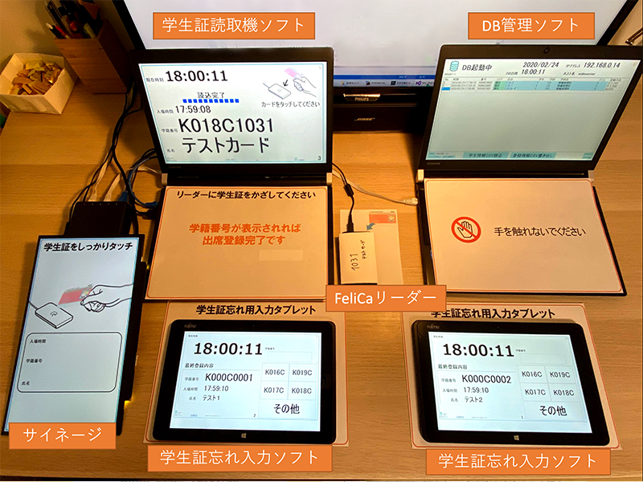
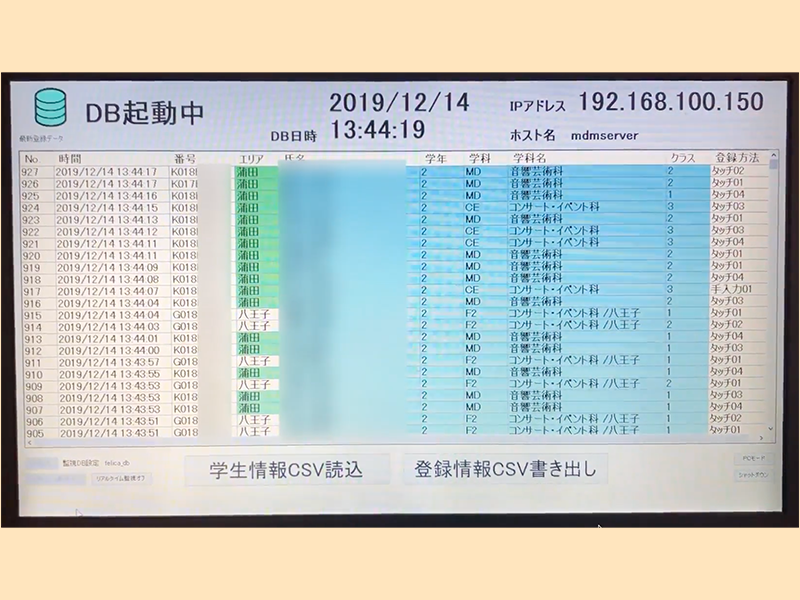
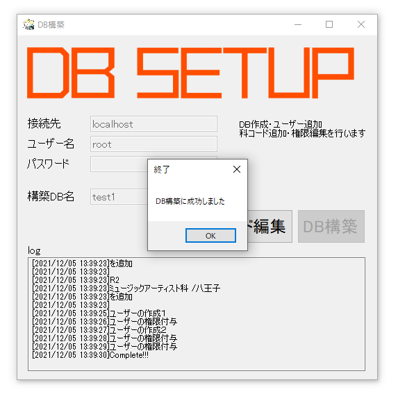
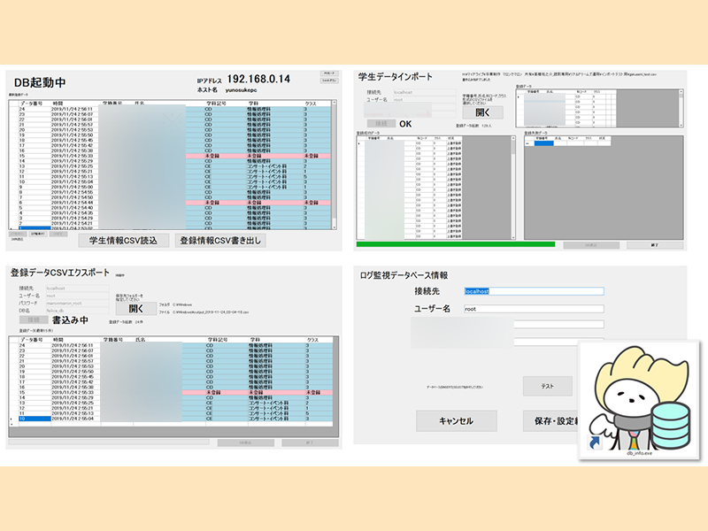
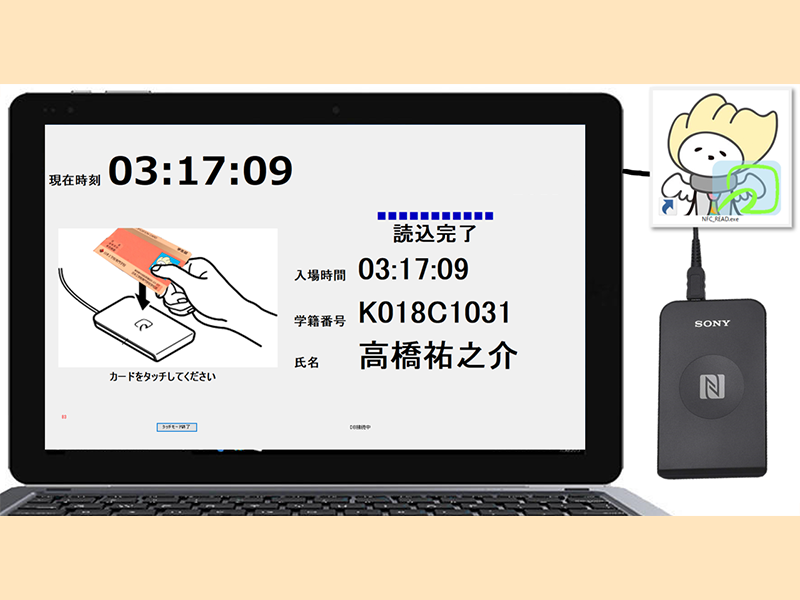
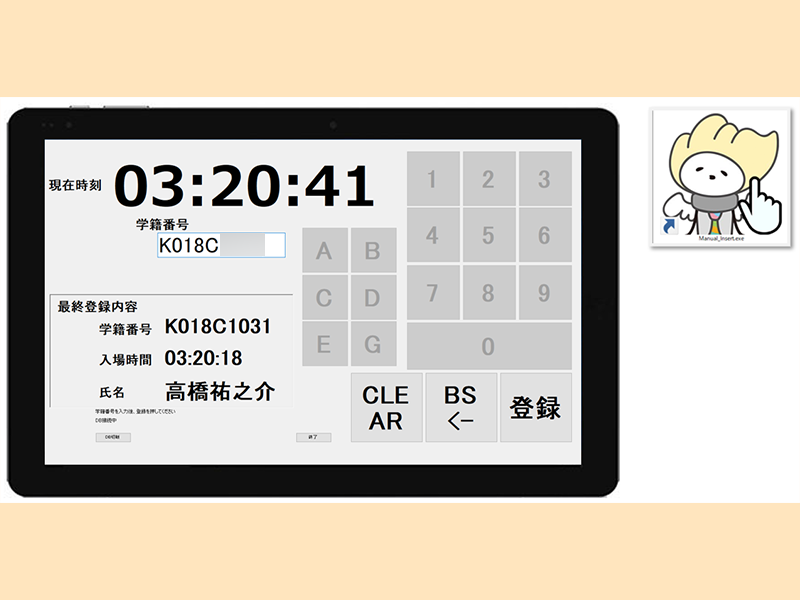

# FeliCa-attendance-registration-system について
このシステムはを学生証を使用して入場管理（出席登録）をできるようにしたプログラムです．
このシステムは日本工学院専門学校の学籍番号形式に合わせて作成されています．

   

日本工学院専門学校ミュージックカレッジ最大音楽イベント「リアルドリームス2019」では2000人以上の入場管理を行いました．  
いままで点呼して，記録していた物を学生証をタッチする事で簡単に管理する事ができました．   
以下の写真は実際に入場管理を行っている時のDB管理ソフトウェアの画面です．

  

# 必要な物
Windows搭載パソコンやタブレットとMySQLサーバに加え，PaSoRiリーダを用意してください．
# 各種プログラム
このレポジトリには大きく分けて4つのプログラムが含まれています．
## DB_CREATE
フォルダDB_CREATEにはMySQLの接続先を指定する事で，システムの動作に必要なデータベースを自動構築するソフトウェアが含まれています．

  

## DB_INFO
フォルダDB_INFOにはデータベース管理画面が含まれています．
学生情報入力取り込み，入場履歴ファイル出力，入場履歴のリアルタイム表示を行います．

  

## Felica_Read
フォルダFelica_Readには学生証情報読み取りソフトウェアが含まれています．

  

## Manual_Insert
フォルダManual_Insertには学生証を忘れた人向けの手入力ソフトウェアです．
タブレットでの使用を想定して作成されています．

  